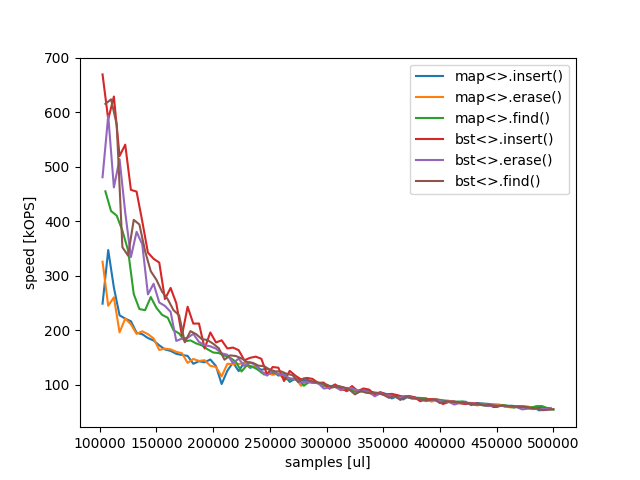
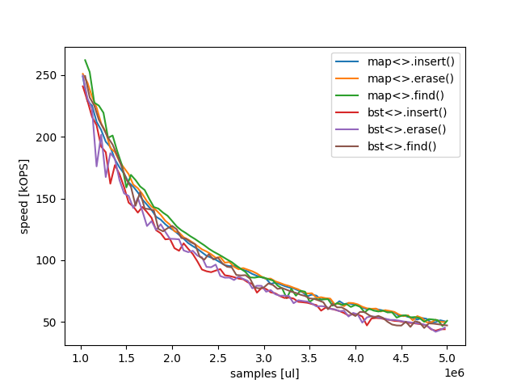
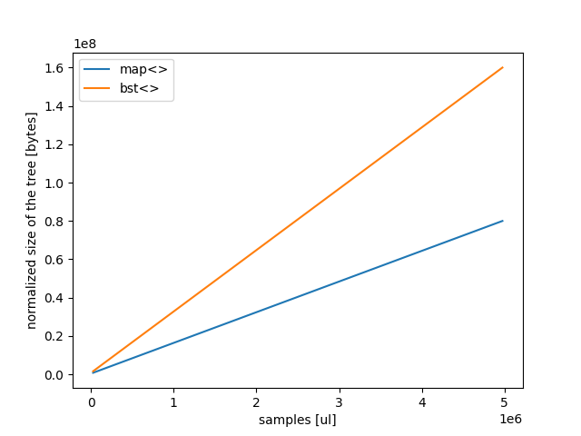
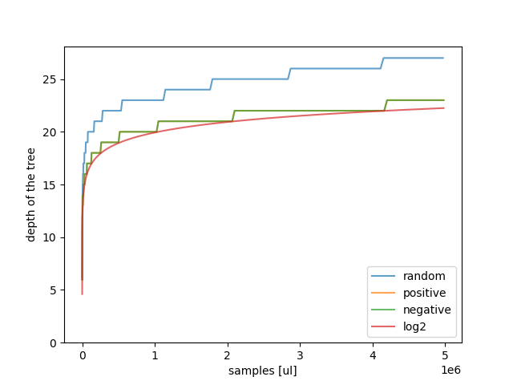

# Binary Search Tree C++11
#### Advanced Programming Exam 2021

The project consists of an implementation of a binary search tree. In addition
to the tasks provided, a naive and experimental self balancing approach has been
added.

_The implementation is targetted at C++11. Tests and benchmarks uses some advanced
features therefore build target is C++17._

## 🤗 Get

Requirements: `g++`, `build-essentials` (`make`), `valgrind` (if testing mem-leaks)

```shell
git clone https://github.com/svaraborut/binary-search-tree.git

# Build
make

# Test
./test

# Test mem-leaks (note it may take quite some time)
valgrind --tool=memcheck ./bench

# Benchmark
./bench
```

## 💹 Benchmarks

Benchmark environment
```text
Os:
    Windows 10 Home - 2004 (19041.746)
    Windows Feature Experience Pack 120.2212.551.0
Architecture:
    x64 but code was built for x32 (except for the 50M test)
    AMD Ryzen 9 3900X 12-Core
    64.0 GB RAM
Build:
    CMake 3.17.5
    C++17
```

Project also includes a complete benchmark suite (see `bench.cpp`) that performs
comparative tests on `bst<>` against `std::map<>`.

_The `bench` executable outputs two files `bst_dump.csv` and `map_dump.csv` that
contains the profile of the benchmark for `bst` and `map` respectively. This files
shall be copied to `./plot` where the `plot.py` script can be run to generate the
charts._


#### 🤔 Comparative tests

Originally i was planning to make just this simple tabular print. Unfortunately
the results were not as expected. The first result i got, depicted my implementation
as 5x faster than `std::map`, this of course was not possible. Indeed `std::map` has
some debug features that slows it down when build target is debug. 😅

Fixing the build environment still the `bst<>` is winning over `std::map`, but
now just by a slight margin. Ultimately, I was not expecting such performance by
a fast implementation, this calls for further investigation 🤔. The investigation
eventually lead to the extension of the benchmark suite... 

```text
std::map<> performances (64x release build)

sizeof(map<>::node_type) 16
sizeof(std::map<K, V>::value_type) 16
estimated normalized size= 79999984
------------------------------------------------------------------------------------------------------------------
| Action        | Took          | total         | pos_rate      | neg_rate      | positive      | negative       |
------------------------------------------------------------------------------------------------------------------
| map<> Insert  | 1.05782       | 5000000       | 1             | 0             | 5000000       | 0              |
------------------------------------------------------------------------------------------------------------------
| map<> Find    | 0.683921      | 5000000       | 1             | 0             | 5000000       | 0              |
------------------------------------------------------------------------------------------------------------------
| map<> Erase   | 0.134039      | 5000000       | 0.0065536     | 0.993446      | 32768         | 4967232        |
------------------------------------------------------------------------------------------------------------------

bst<> performances (64x release build)

sizeof(bst<>::node_type) 48
sizeof(bst<K, V>::value_type) 16
estimated normalized size= 160000000
------------------------------------------------------------------------------------------------------------------
| Action        | Took          | total         | pos_rate      | neg_rate      | positive      | negative       |
------------------------------------------------------------------------------------------------------------------
| bst<> Insert  | 0.639946      | 5000000       | 1             | 0             | 5000000       | 0              |
------------------------------------------------------------------------------------------------------------------
| bst<> Find    | 0.631802      | 5000000       | 1             | 0             | 5000000       | 0              |
------------------------------------------------------------------------------------------------------------------
| bst<> Erase   | 0.128389      | 5000000       | 0.0065536     | 0.993446      | 32768         | 4967232        |
------------------------------------------------------------------------------------------------------------------
```

After extending the benchmark suite the following results appear to still confirm
the original findings. Performances are higher, but not for so long. At 250k entries
`std::map<>` catches up the `bst<>` performances.



Eventually surpassing them at around 1.5M entries.




The size of the `bst<>` implementation is 2x compared to `map<>`. This is mainly due
to `map<>::node` containing only two pointers, whether `bst<>::node` contains three
pointers and the `depth` cache variable.

_The presented size is only the tree structure size hence excluding both the key
and the value_



Further investigation even proves a very steady tree depth growth. Where `positive`
and `negative` insertion (keys are inserted in ascending or descending order
respectively) show almost optimal (log2) performances and random insertion has a
steady 113% of log2.



#### 🤔 Conclusions

Honestly I was not expecting such performances, having implemented a naive balancing
approach that just popped in my mind when reading
[Red-Black tree on Wikipedia](https://en.wikipedia.org/wiki/Red%E2%80%93black_tree).
After spending more time in investigating the performances than the original
implementation I came to the conclusion that there is something strange going on.
Maybe:

- There may be something obvious that I'm missing in the testing (as at first glance
  I missed the debug compilation performance hit on `std::map`)
- Despite the extensive testing there may still be a bug in the implementation.
- In `std::map` branch nodes has only `left` and `right` pointers making my
  implementation with `parent` pointer faster when traversing the tree upward. Or
  having the `depth` cached in nodes makes the balancing evaluations faster.
- `std::map` has a huge penalty when allocating the data having separate leaves to
  store data (eg.: for each insertion has to allocate space for data + for 50% of
  the insertions it has to allocate a new branch node)
- `std::map` has some other allocation penalties

## 🧪 Test

Project include a complete test suite (see `test.cpp`). Two types of tests are performed:

- integrity test: hand written tests designed to verify logic and functional integrity
  of the class.
- stochastic tests: that performs insertion and extraction of data from the map.
  tests are performed with pseudo random values with many values, to attempt to discover
  errors in the tree structure (aka loosing data and making more evident memory leaks).

Tested on
```text
Os:
    ubuntu 20.04 focal-20210119 (Docker image)
Architecture:
    Dell PowerEdge R710
    2x Intel XEON X5650 2.66GHz Six core
    48GB Ram
Build:
    GNU Make 4.2.1
    gcc (Ubuntu 9.3.0-17ubuntu1~20.04) 9.3.0
```

#### 🐳 Docker test environment

```shell
FROM ubuntu:20.04

RUN apt-get -y update
RUN apt-get -y install g++ build-essential git nano
```

## 🔧 API

##### 🙌🏼 Iteration constructor
```c++
template<typename Iter>
bst(Iter begin, Iter end);
```
Create a map from an iterable iterable source of pair<K,V> values.

##### ✔️ Insert
```c++
std::pair<iterator, bool> insert(const pair_type& x);
std::pair<iterator, bool> insert(pair_type&& x);
```
Inserts a pair in the map. If insertion is successful returns an iterator to the pair and true, else the end() iterator and false.

##### ✔️ Emplace
```c++
std::pair<iterator, bool> emplace(Types&&... args);
```
Inserts multiple pairs in the map. If at least one insertion is successful
returns an iterator to the FIRST INSERTED pair and true. If none of the
values has been inserted end() and false are returned.
_Logic here was not defined in the assignment_.

##### ✔️Erase
```c++
size_type erase(const K& k) noexcept;
```
Removes a key from the map.

##### 🙌🏼 Pop
```c++
value_type pop(const K& k) noexcept;
```
Pops a value from the map returning the value.

##### ✔️ Clear
```c++
void clear() noexcept;
```
Removes all the values from the map

##### ✔️ Balance
```c++
void balance() noexcept;
```
Balances the tree

##### 🙌🏼 Has
```c++
bool has(const K& k) noexcept;
```
Weather the map contains a given key

##### ✔️ Find
```c++
iterator find(const K& k) noexcept;
const_iterator find(const K& k) const noexcept;
```
Searches for a key, if the key is present
an iterator that starts at that key is returned
else end() is returned.

##### 🙌🏼 Size
```c++
size_type size() noexcept;
```
Returns the size of the map O(1)

##### 🙌🏼 Empty
```c++
bool empty() noexcept;
```
Check weather the map is empty O(1)

##### 🙌🏼 Depth
```c++
unsigned int depth() noexcept;
```
Returns the current depth of the map O(1)

##### ✔️ Subscripting operator
```c++
V& operator[](const K& k);
V& operator[](K&& k);
```
Allows for easy lookup with the subscript ( @c [] ) operator.  Returns 
data associated with the key specified in subscript.  If the key does
not exist, a pair with that key is created using default values, which
is then returned.

##### 🙌🏼 Function call operator
```c++
iterator operator()(const K& lower, const K& upper) noexcept;
const_iterator operator()(const K& lower, const K& upper) const noexcept;
```
Returns an iterator to a slice of the map. The slice will start
at the first key greater or equal to lower and will end with the
last key lower or equal to upper.

##### ✔️ Begin
```c++
iterator begin() noexcept;
const_iterator begin() const noexcept;
const_iterator cbegin() const noexcept;
```
An iterator of the map elements starting with the lower key

##### ✔️  End
```c++
iterator end() noexcept;
const_iterator end() const noexcept;
const_iterator cend() const noexcept;
```
The end iterator for this map (a simple nullptr reference)

##### ✔️ Put-to operator
```c++
friend std::ostream& operator<<(std::ostream& os, const bst& x);
```
Prints the json-style representation of the map

##### 🙌🏼 Print tree info (DEBUG)
```c++
void tree_info();
void tree_info(std::ostream& os);
```
Prints the tree info. Example output:
```txt
bst{size=123, root=013307F8}
```

##### 🙌🏼 Print tree structure (DEBUG)
```c++
void print_tree();
void print_tree(std::ostream& os);
```
Prints the tree structure. Example output:
```txt
Size: 10
01330AF8 [depth=3, parent=00000000, left=013307F8, right=01330D98] (4:)
|->L 013307F8 [depth=1, parent=01330AF8, left=01330858, right=01330DF8] (2:)
|    |->L 01330858 [depth=0, parent=013307F8, left=00000000, right=00000000] (1:)
|    |    |->L (empty)
|    |    -->R (empty)
|    -->R 01330DF8 [depth=0, parent=013307F8, left=00000000, right=00000000] (3:)
|         |->L (empty)
|         -->R (empty)
-->R 01330D98 [depth=2, parent=01330AF8, left=01330D38, right=01330B58] (8:)
     |->L 01330D38 [depth=1, parent=01330D98, left=013308B8, right=01330CD8] (6:)
     |    |->L 013308B8 [depth=0, parent=01330D38, left=00000000, right=00000000] (5:)
     |    |    |->L (empty)
     |    |    -->R (empty)
     |    -->R 01330CD8 [depth=0, parent=01330D38, left=00000000, right=00000000] (7:)
     |         |->L (empty)
     |         -->R (empty)
     -->R 01330B58 [depth=1, parent=01330D98, left=00000000, right=01330918] (9:)
          |->L (empty)
          -->R 01330918 [depth=0, parent=01330B58, left=00000000, right=00000000] (10:)
               |->L (empty)
               -->R (empty)
```

### 😟 Cheats

Erase function signature has been modified to return the quantity of elements
deleted.
```c++
size_type erase(const key_type& x);
```
